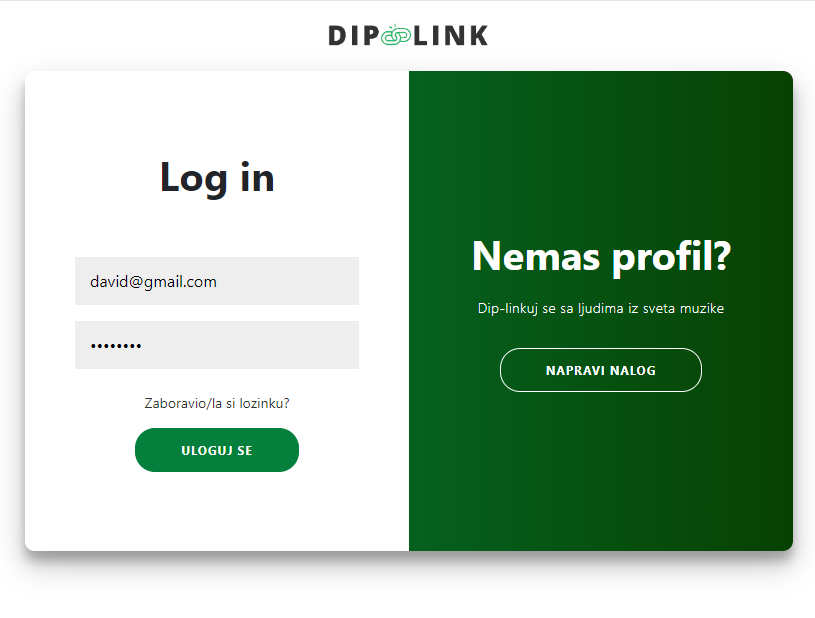
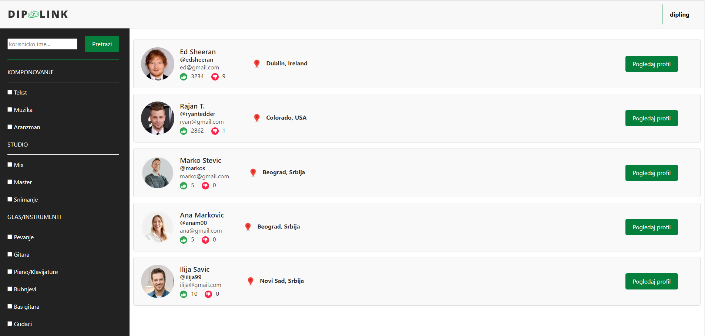

# About the platform "Diplink"
A full-stack web platform designed to connect musicians. Users can create profiles, showcase their talents, search for other musicians based on skills or instruments, and collaborate on projects. Built with the MEAN stack (MongoDB, Express, Angular, Node.js) for efficient and scalable performance.

Below are the application layouts for all usage scenarios.

  
Show Screenshots

  ### Screenshot 1
  

  ### Screenshot 2
  

