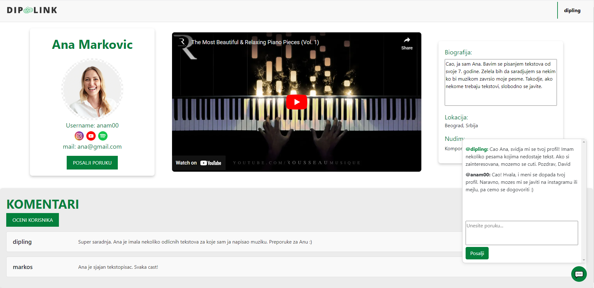
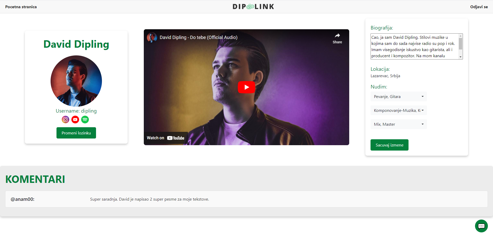
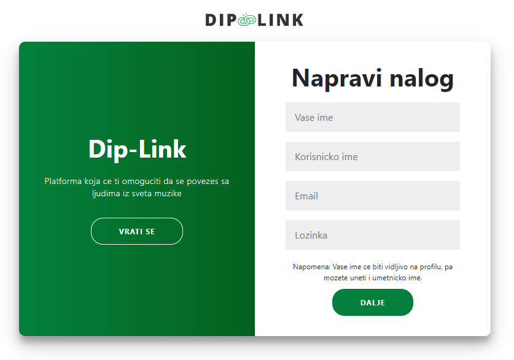
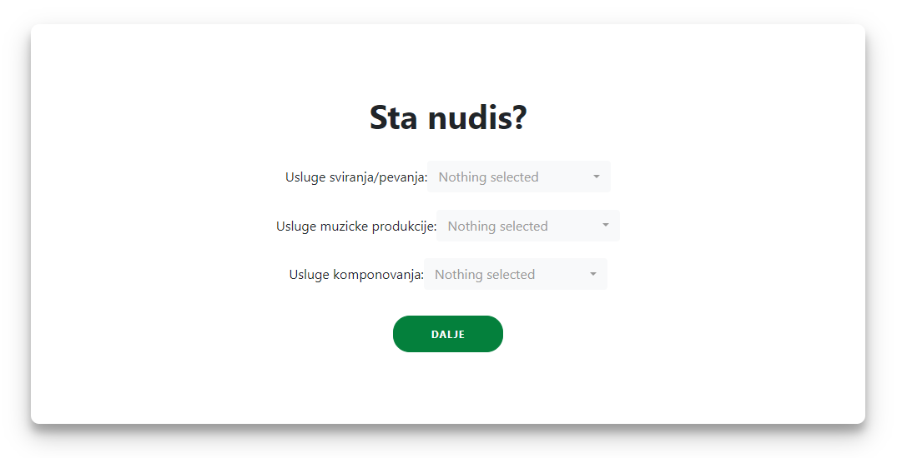

# About the platform "Diplink"
A full-stack web platform designed to connect musicians. Users can create profiles, showcase their talents, search for other musicians based on skills or instruments, and collaborate on projects. Built with the MEAN stack (MongoDB, Express, Angular, Node.js) for efficient and scalable performance.

Below are the application layouts for all usage scenarios.

  
Show Screenshots

  ### LogIn/Register Page
  

  ### Explore Page
  

  ### User Profile Page with Chat system
  

  ### My profile
  

  
Registration process

  ### LogIn/Register Page
  

  ### Register 1/3
  

  ### Register 2/3
  

  ### Register 3/3
  

#Licence
Copyright 2024. David Maslovaric